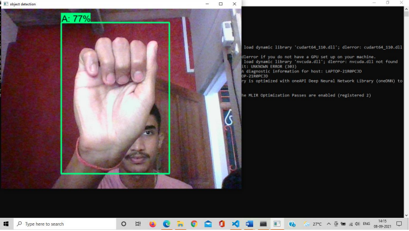
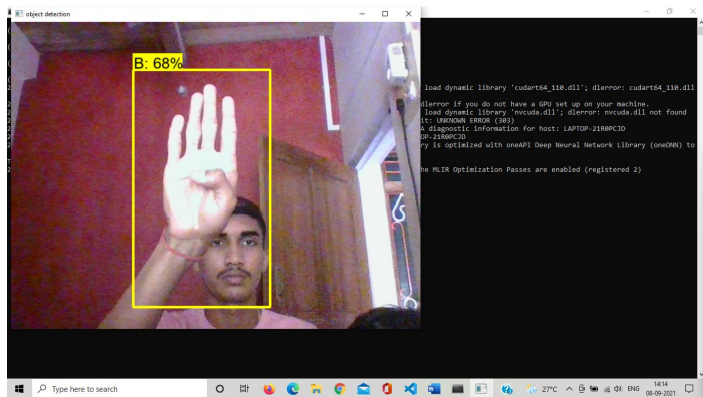

# Sign Language Translator

SSD is a popular algorithm in object detection. It’s generally faster than Faster RCNN. In this project we have train SSD model on custom dataset , by doing this model is able to classify various type of 'Alphabets'. This way an effective Sign language Translator can be made . This type of project is not only bound to SSD-mobilenet , various Object detection algorithm can be used. 

### Print Detailed Info About Each Detection (class, confidence, bounding box coordinates)
I have created a custom flag called <strong>INFO</strong> that can be added to any detect.py or detect_video.py commands in order to print detailed information about each detection made by the object detector. To print the detailed information to your command prompt just add the flag `--info` to any of your commands. The information on each detection includes the class, confidence in the detection and the bounding box coordinates of the detection in xmin, ymin, xmax, ymax format.

### Output of the Model

####         For A in American Sign Language

####         For B in American Sign Language

# REFERENCES

https://tensorflow-object-detection-apitutorial.readthedocs.io/en/latest/
https://www.tensorflow.org/lite/examples/object_detection/overview
https://towardsdatascience.com/custom-object-detectionusing-tensorflow-from-scratch-e61da2e10087
https://medium.com/@techmayank2000/object-detectionusing-ssd-mobilenetv2-using-tensorflow-api-can-detect-anysingle-class-from-31a31bbd0691
https://medium.com/dataseries/understanding-the-mathsbehind-neural-networks-108a4ad4d4db
https://purnasaigudikandula.medium.com/a-beginner-intro-toneural-networks-543267bda3c8
https://youtu.be/HbP_D_MctCM
